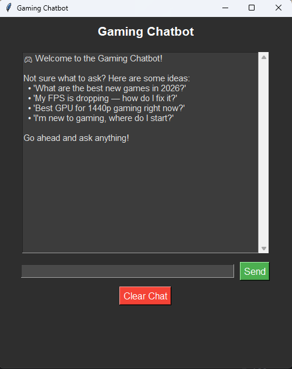

cat << 'EOF' > README.md
# 🎮 Gaming Chatbot

A desktop utility chatbot built with Python and Tkinter that acts as a localized, intelligent gaming assistant. It utilizes Natural Language Processing (NLP) to understand user intent and provide instant recommendations, tech troubleshooting steps, hardware advice, and general gaming knowledge.

---

## 📷 Preview
Here is a look at the desktop user interface in action:

---

## 🚀 Key Features

- **Semantic Search Engine:** Uses `SentenceTransformer` (`all-MiniLM-L6-v2`) to measure semantic similarity, allowing it to understand user intent even if phrasing differs from predefined keywords.
- **Comprehensive Knowledge Base:** Contains specialized answers for 2025/2026 releases, competitive ranking tips, hardware optimization (GPUs/CPUs like the Ryzen 7 9800X3D or RX 9070 XT), and common technical fixes.
- **Clean Desktop UI:** Built using `tkinter` and `scrolledtext` featuring a sleek, dark-themed interface with dedicated interactive controls (Send / Clear Chat).

---

## 🛠️ Requirements & Installation

Before running the application, make sure you have Python 3.10+ installed along with the required libraries.

1. Clone or download this folder to your machine.
2. Open your terminal inside this folder and install the dependencies:

pip install sentence-transformers torch

EOF
